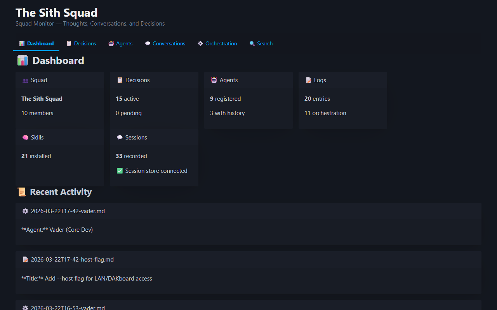
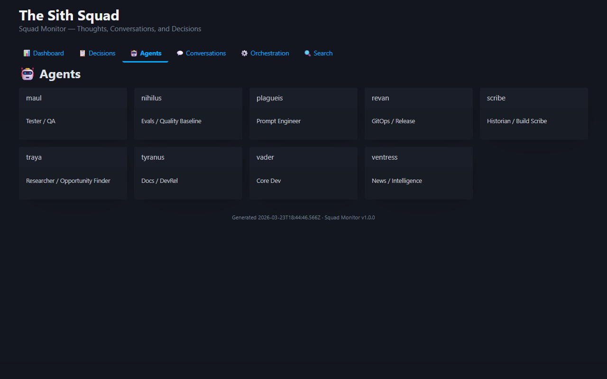
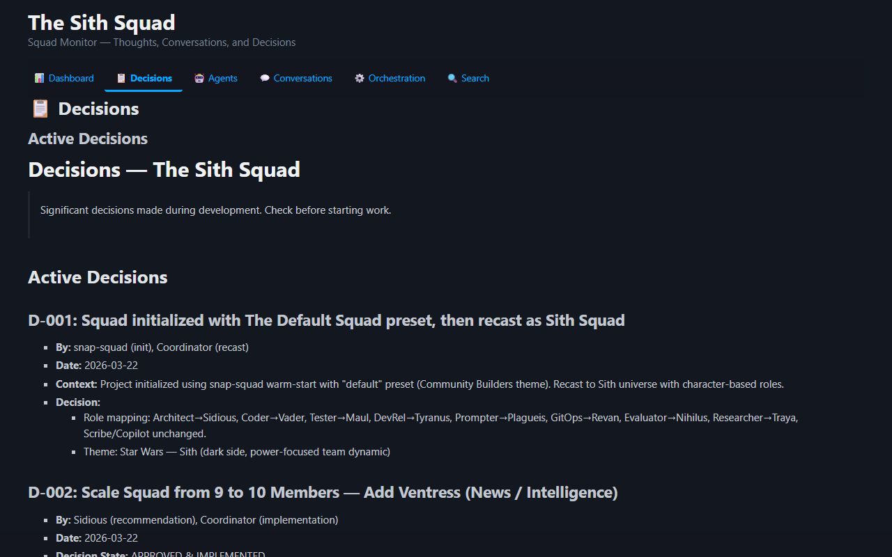
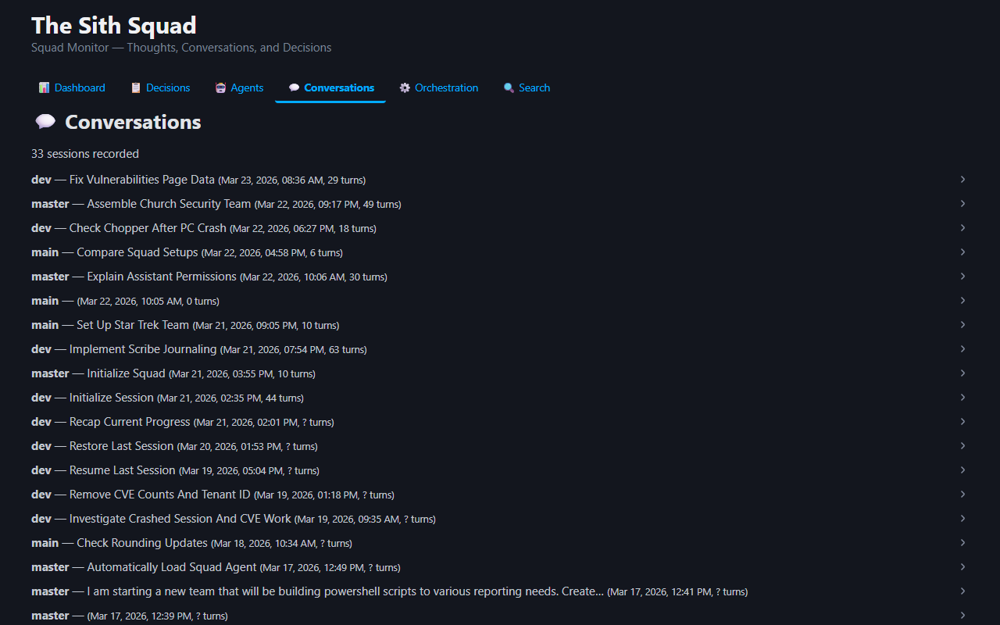
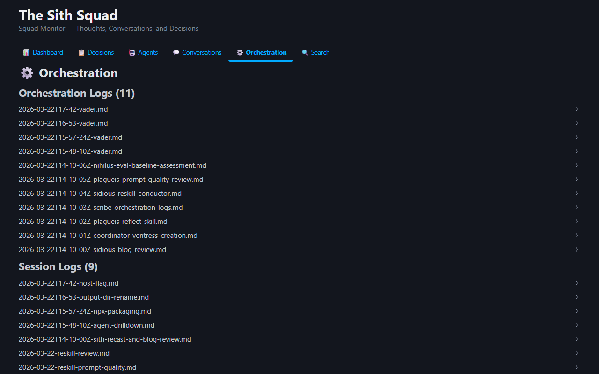
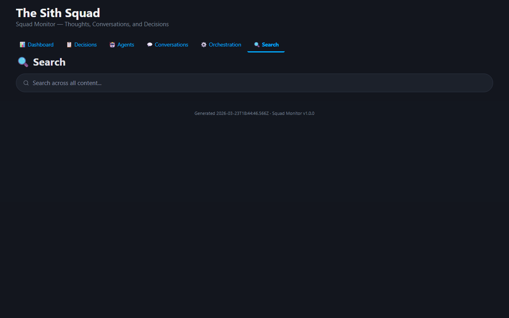

# Squad Monitor

A browser dashboard for visualizing squad activity, decisions, and agent interactions from the Copilot CLI session store and `.squad/` directory. Choose static mode for zero cost or live mode for auto-refresh.

> 🤖 **Built by AI.** This project was conceived, designed, and coded entirely by an AI development team using [Squad](https://github.com/bradygaster/squad) — a multi-agent coordination framework for GitHub Copilot. Community contributions, feedback, and ideas are welcome — feel free to open an issue or submit a PR.

## Screenshots

### 📊 Dashboard
Overview stats — agent count, decisions, sessions, skills, and recent activity feed.



### 🤖 Agents
Clickable agent cards showing each team member's role. Click to expand charter and history.



### 📋 Decisions
Full decision ledger rendered from `decisions.md`, with pending inbox items.



### 💬 Conversations
Session list from the Copilot CLI session store — expandable turns and checkpoints.



### ⚙️ Orchestration
Timeline of orchestration logs and session logs.



### 🔍 Search
Client-side full-text search across all rendered content.



## Portable Usage (npx)

Run Squad Monitor as a portable CLI from any directory — no need to clone this repo or install dependencies locally.

```bash
# Build a static dashboard from your squad project
npx squad-monitor build

# Start a live development server
npx squad-monitor dev

# Show available options
npx squad-monitor --help
```

**Common options:**
- `--squad-root <path>` — Path to squad project root (default: current directory)
- `--db <path>` — Path to session store database (default: `~/.copilot/session-store.db`)
- `--port <port>` — Dev server port (default: 3000)
- `--host <address>` — Bind address for dev server (default: `localhost`). Use `0.0.0.0` to listen on all interfaces — useful for DAKboard, kiosk wall displays, or any LAN device.

**Requirements:**
- Node.js 18+ (automatically downloaded by npx)
- A `.squad/` directory in your project

**Example:**
```bash
npx squad-monitor build --squad-root ~/my-project --db ~/.copilot/session-store.db
```

This generates `.squad-monitor/index.html` in your current directory — a complete, self-contained dashboard ready to share or archive.

## Getting Started

**Quick start:** Use `npx squad-monitor` to run from any directory (see Portable Usage above).

**Local development:** Clone this repo and run locally.

### Install and Build

**Portable (npx):**
```bash
npx squad-monitor build
npx squad-monitor dev
```

**Local development (cloned repo):**
```bash
npm install
npm run build
npm run dev
```

### View the Dashboard

**Windows:**
```bash
npm run view
```

**macOS / Linux:**
```bash
open .squad-monitor/index.html
```

The `.squad-monitor/index.html` is a complete, self-contained dashboard. No server, no runtime cost.

## Static Mode (Zero Cost)

**Perfect for:** Sharing reports, archiving decisions, offline browsing.

```bash
# Portable (npx) — works from any directory
npx squad-monitor build

# Local development (cloned repo)
npm run build
```

Then open the generated file:
```bash
start .squad-monitor/index.html   # Windows
open .squad-monitor/index.html    # macOS/Linux
```

The output is a single HTML file with all data embedded. To refresh, re-run the build command and reload the browser.

## Live Mode (Auto-Refresh)

**Perfect for:** Development and real-time monitoring.

```bash
# Portable (npx) — works from any directory
npx squad-monitor dev

# Local development (cloned repo)
npm run dev
```

- Starts Express server at `http://localhost:3000`
- Dashboard auto-refreshes every 10 seconds when `.squad/` files change
- Shows toast notification before reloading
- Includes manual 🔄 refresh button in the header
- Server uses ~20MB RAM while running

**Stop the server:** Press `Ctrl+C`

**Arguments:**
```bash
# Portable
npx squad-monitor dev --port 8080 --squad-root ./my-squad --db ~/.copilot/session-store.db

# Listen on all interfaces (for DAKboard / kiosk displays on your LAN)
npx squad-monitor dev --host 0.0.0.0

# Local
npm run dev -- --port 8080 --squad-root ./my-squad --db ~/.copilot/session-store.db
```

## Dashboard Tabs

1. **📊 Dashboard** — Overview stats (agent count, decisions, sessions, pending items), recent activity feed
2. **📋 Decisions** — Full decisions.md rendered, pending inbox items with badges
3. **🤖 Agents** — Clickable agent cards → expand to view full charter and history
4. **💬 Conversations** — Session list from Copilot → expandable turns and checkpoints
5. **⚙️ Orchestration** — Timeline of orchestration logs and session logs
6. **🔍 Search** — Client-side full-text search across all rendered content

## Architecture

| File | Purpose |
|------|---------|
| `src/data-reader.js` | Reads `.squad/` markdown files |
| `src/session-reader.js` | Reads Copilot session-store.db (sql.js WASM) |
| `src/html-generator.js` | Generates HTML with Pico.css dark theme |
| `scripts/build.js` | Static build: `.squad/` + DB → .squad-monitor/index.html |
| `scripts/serve.js` | Live server: Express + auto-refresh |

## Data Sources

- `.squad/decisions.md` + `.squad/decisions/inbox/*.md` — Decisions
- `.squad/agents/*/charter.md` + `history.md` — Agent identities and learnings
- `.squad/team.md` — Squad roster
- `.squad/orchestration-log/*.md` — Orchestration history
- `.squad/log/*.md` — Session logs
- `.squad/skills/*/SKILL.md` — Knowledge library
- `.squad/ceremonies.md` — Ceremony definitions
- `~/.copilot/session-store.db` (optional) — Copilot CLI conversation history

## Requirements

- Node.js 18+
- A `.squad/` directory (Squad framework)
- `~/.copilot/session-store.db` (optional) — Conversations tab degrades gracefully without it

## Design Principles

- **Zero runtime cost** in static mode
- **Graceful degradation** — works without session store
- **Dark theme** — built with [Pico.css](https://picocss.com)
- **Single-file output** — easy sharing and archival
- **Smart polling** — live mode only reloads when data changes

## License

MIT
